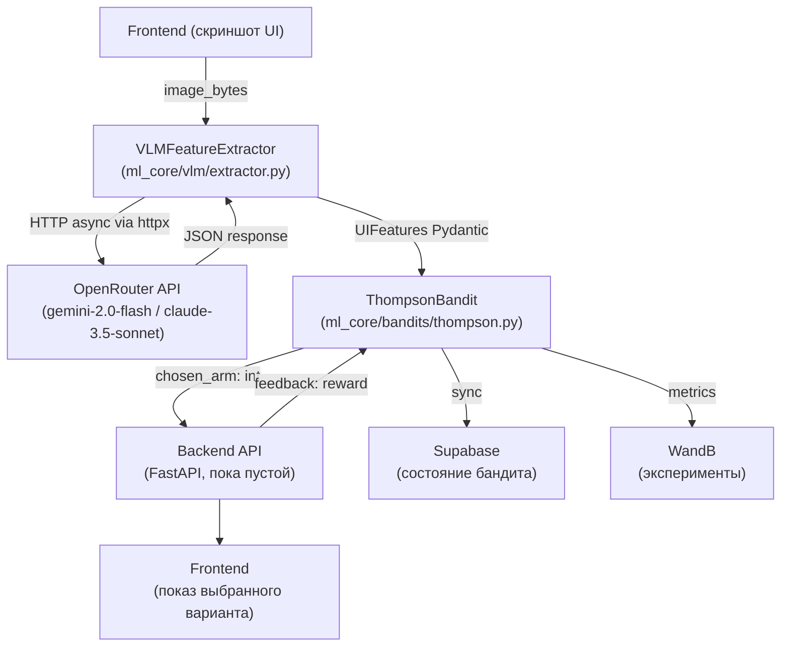

# 🔍 Ревью проекта: `auto-cro-system`

## 1. Что решает проект?

**Auto-CRO** (Automatic Conversion Rate Optimization) — система автоматической оптимизации конверсии веб-интерфейсов с использованием обучения с подкреплением.

**Суть идеи:**
1. У тебя есть несколько вариантов UI (кнопок, лэйаутов, текстов).
2. Ты делаешь скриншот текущего UI и отправляешь его в мультимодальную LLM (VLM) через OpenRouter.
3. VLM возвращает структурированный вектор признаков: виден ли CTA-элемент, цвет кнопки, тональность текста, визуальная перегруженность.
4. Этот вектор контекста подаётся в **Contextual Thompson Sampling** бандит, который выбирает лучший вариант UI.
5. После получения обратной связи (клик / игнор) бандит обновляет своё байесовское распределение и становится умнее.

**Целевая аудитория** — продуктовые команды, которые хотят автоматизировать A/B-тестирование и заменить его на более умный онлайн RL.

---

## 2. Архитектура проекта

### Компоненты

| Компонент | Файл | Описание |
|---|---|---|
| **VLM Extractor** | `ml_core/vlm/extractor.py` | Async HTTP-клиент к OpenRouter, парсинг в Pydantic |
| **Thompson Bandit** | `ml_core/bandits/thompson.py` | Contextual Linear Thompson Sampling на PyTorch (`nn.Module`) |
| **Pipeline** | `main_pipeline.py` | Оркестратор: VLM → фичи → бандит |
| **Backend API** | `backend/api/` | FastAPI (пустая директория) |
| **Schemas** | `backend/schemas/` | Pydantic-схемы API (пустая директория) |
| **Frontend** | `frontend/templates/` | HTML-шаблоны (пустая директория) |
| **Math Spec** | `docs/math_spec.md` | Математическая документация алгоритма |
| **MCP Server** | `mcp_supabase_server.py` | JSON-RPC сервер для работы с Supabase через MCP |

### Технологический стек

- **Python 3.13**, `uv` как менеджер пакетов
- **PyTorch** — матричные операции бандита, поддержка GPU
- **httpx** — async HTTP-клиент для OpenRouter API
- **Pydantic v2** — строгая валидация JSON от VLM
- **FastAPI + Uvicorn** — backend (задекларирован, не реализован)
- **Supabase** — хранилище состояния бандита и логов
- **WandB** — трекинг экспериментов
- **mypy, ruff, pytest** — инструменты качества кода

---

## 3. Оценка архитектуры

### ✅ Сильные стороны

- **Математика реализована правильно.** `ThompsonBandit` корректно имплементирует Linear Thompson Sampling: `A = A + x·xᵀ`, `b = b + r·x`, семплирование из `MultivariateNormal`. Батчинг по `n_arms` сделан изящно через `register_buffer` с shape `[k, d, d]`.
- **Асинхронность заложена правильно.** `extractor.py` использует `httpx.AsyncClient`, `non_blocking=True` при переносе тензоров на GPU — правильная практика для FastAPI.
- **Pydantic v2 для валидации VLM.** Схема `UIFeatures` строго типизирует выход LLM, промпт динамически генерирует JSON Schema — хороший паттерн.
- **Разделение ответственности.** ML-ядро (`ml_core`) чётко отделено от транспорта (backend) и UI (frontend).
- **Документация по математике есть** — `docs/math_spec.md` содержит полные выводы формул алгоритма.

### ⚠️ Архитектурные замечания

| Проблема | Описание |
|---|---|
| **Расхождение math_spec ↔ реализация** | В `math_spec.md` бандит имеет одну матрицу `B` (shared) и работает с `N` контекстами-вариантами. В `thompson.py` — `k` матриц `A[arm_idx]`, что соответствует классическому multi-arm, а не shared Thompson Sampling. Нужно определиться с целевой архитектурой. |
| **Нет `__init__.py`** | В `ml_core/`, `ml_core/bandits/`, `ml_core/vlm/` нет файлов `__init__.py`, из-за чего импорты в `main_pipeline.py` могут не работать как Python-пакеты. |
| **`extractor.py` — частичная бага** | Блок `async with ... as client:` закрывает соединение до `response.json()`, который вызывается вне контекста. Исправлено правильно только если `response.json()` вызывать внутри `async with`. |
| **`mcp_supabase_server.py` — заглушка** | MCP-сервер регистрирует инструмент `check_supabase`, но не реализует его логику. `sync_with_db` в бандите тоже `pass`. |
| **Нет тестов** | Директория `tests/` отсутствует полностью. `pytest` есть в dev-зависимостях. |
| **Type hints неполные** | `project_context.md` требует `mypy --strict`, но в файлах отсутствуют аннотации для `mcp_client` в `sync_with_db`. |

---

## 4. Текущее состояние: что сделано

| # | Задача | Статус |
|---|---|---|
| 1 | Структура проекта (`ml_core`, `backend`, `frontend`, `docs`) | ✅ Создана |
| 2 | Математическая спецификация алгоритма (`math_spec.md`) | ✅ Готова |
| 3 | Pydantic-схема `UIFeatures` (4 признака) | ✅ Готова |
| 4 | `VLMFeatureExtractor.extract()` — async OpenRouter call | ✅ Реализован |
| 5 | `ThompsonBandit.__init__()` — буферы A и b | ✅ Готово |
| 6 | `ThompsonBandit.sample()` — выбор ручки | ✅ Реализован |
| 7 | `ThompsonBandit.update()` — байесовское обновление | ✅ Реализован |
| 8 | `main_pipeline.py` — черновик оркестратора | ✅ Задрафтован (с TODO) |
| 9 | `pyproject.toml` — зависимости | ✅ Полностью настроен |
| 10 | `mcp_supabase_server.py` — MCP JSON-RPC сервер | ✅ Скелет (инструмент не реализован) |
| 11 | `project_context.md` — правила для AI-агента | ✅ Готово |

---

## 5. Что предстоит сделать

### 🔴 Критический путь (MVP)

1. **Добавить `__init__.py`** в `ml_core/`, `ml_core/bandits/`, `ml_core/vlm/` — без этого проект не запустится.
2. **Пофиксить баг в `extractor.py`** — перенести `response.json()` внутрь блока `async with`.
3. **Реализовать `main_pipeline.py`** — собрать 3 TODO:
   - Вызвать `extractor.extract(image_bytes)`
   - Преобразовать `UIFeatures` → `torch.tensor([...], shape=[1, 4])`
   - Передать тензор в `bandit.sample(context)` и вернуть результат
4. **Тестовый запуск pipeline** — в блоке `if __name__ == "__main__"` загрузить тестовое изображение и запустить полный цикл.

### 🟡 Backend (следующий этап)

5. **FastAPI приложение** (`backend/api/`) — эндпоинты:
   - `POST /extract` — принять изображение, вернуть выбранный вариант UI
   - `POST /feedback` — принять reward, вызвать `bandit.update()`
6. **Pydantic-схемы API** (`backend/schemas/`) — `ExtractionRequest`, `FeedbackRequest`, `DecisionResponse`
7. **Глобальное состояние бандита** — синглтон или dependency injection FastAPI для сохранения весов между запросами

### 🟡 MLOps

8. **Supabase интеграция** — реализовать `ThompsonBandit.sync_with_db()`:
   - Сериализация тензоров `A` и `b` (например, через `torch.save` → bytes → base64)
   - Сохранение/загрузка из таблицы Supabase
9. **WandB логирование** — логировать `chosen_arm`, `reward`, `uncertainty` (σ²) на каждом шаге
10. **MCP `check_supabase`** — реализовать реальный запрос к Supabase

### 🟢 Качество кода

11. **Тесты** (`tests/`) — unit-тесты для `ThompsonBandit.update()` и `sample()`, mock-тест для `VLMFeatureExtractor`
12. **Полные Type Hints** — добиться прохождения `mypy --strict`
13. **README.md** — сейчас пустой, нужна документация запуска

### 🔵 Frontend

14. **HTML-шаблоны** (`frontend/templates/`) — интерфейс для демонстрации работы системы

---

## 6. Итоговая оценка

| Аспект | Оценка | Комментарий |
|---|---|---|
| **Идея/Задача** | 9/10 | Нетривиальная, прикладная, хорошо осмыслена |
| **Математика** | 8/10 | Корректная имплементация TS, нужно унифицировать с math_spec |
| **ML-код** | 7/10 | Хороший скелет, есть мелкий баг в extractor |
| **Инфраструктура** | 5/10 | Зависимости есть, но backend/frontend — пустые директории |
| **Готовность** | ~30% | ML-ядро почти готово, весь остальной стек — не выполнен |

**Вывод:** Проект находится в конце **Sprint 1** (ML Core). ML-ядро (`extractor`, `thompson`) написано и близко к рабочему состоянию. Следующий ключевой шаг — замкнуть цикл в `main_pipeline.py` и поднять FastAPI backend для первого end-to-end теста.
